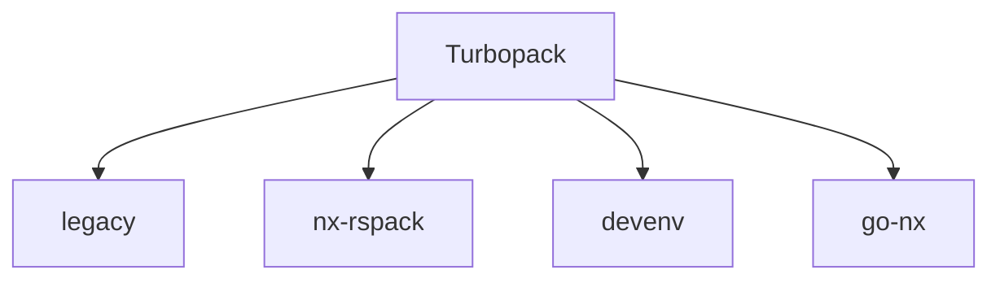

Certainly! Below is the revised README with added clarity, structured sections, and the inclusion of some Mermaid diagrams for visual representation.

---

# Turbopack

Turbopack is a high-performance monorepo setup that streamlines the development, testing, and deployment of multiple interconnected projects. With a focus on speed, scalability, and developer experience, Turbopack leverages modern tooling and best practices to ensure your monorepo remains maintainable and efficient as it grows.

## Features

- **Fast Builds**: Leveraging incremental builds and intelligent caching.
- **Unified Dependencies**: Centralized dependency management to avoid version conflicts.
- **Consistent Tooling**: Shared configuration for linting, testing, and building.
- **Isolated Environments**: Sandbox environments for each project.
- **Easy Collaboration**: Simplified setup for new contributors.
- **Scalable Architecture**: Designed to handle projects of any size.

## Getting Started

### Prerequisites

- **Node.js** (>=14.x)
- **Yarn** (>=1.22.x)

### Installation

Clone the repository and install dependencies:

```bash
git clone https://github.com/yourusername/turbopack.git
cd turbopack
yarn install
```

### Project Structure

```plaintext
turbopack
│
├── legacy       # Legacy code & servers
├── nx-rspack    # Rspack monorepo using module federation of legacy UI and new UI
├── devenv       # Scripts to run Docker images
└── go-nx        # Go modules workspace for GraphQL API
```



### Usage

Use `go-nx` commands to create libraries and applications within the project.

### Known Issues

- **Legacy Code**: Not working with Docker. Ensure Dockerfiles are agnostic and configurations are correct.
- **UI Module Federation**: Proper integration of legacy and new UI is required.
- **Golang Migration**: Migrate Golang code to the new base.

## Contributing

We welcome contributions from the community! Please read our [contributing guide](CONTRIBUTING.md) to get started.

## License

Turbopack is licensed under the MIT License. See the [LICENSE](LICENSE) file for more details.

## Contact

For any questions or suggestions, please open an issue or reach out to [maintainer@example.com](mailto:maintainer@example.com).

---

Happy coding! 🚀

